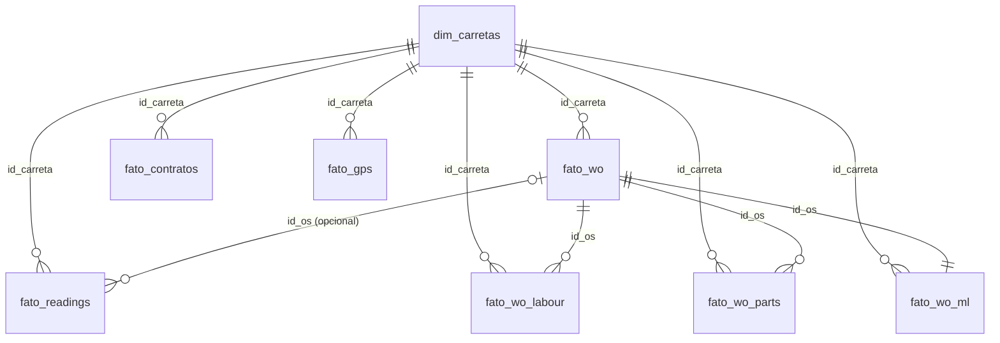

# Dicionário de Dados — Custo de Manutenção Interno por KM

**Projeto Quatro Norte / MBA — Grupo 01**
Fonte: extração `data/extract_custo_interno_km.sql` (SQLcl → `data/raw/*.csv`)
Janela de análise: **2020-01-01 a 2025-12-31**

---

## 1. Visão geral

A extração gera **8 arquivos CSV** que, juntos, permitem calcular o **custo de manutenção interno por quilômetro** das carretas próprias da Trailcon. O modelo combina uma dimensão de carretas (`dim_carretas`), fatos normalizados e um fato enriquecido para modelagem (`fato_wo_ml`).

O escopo analítico atual **não é restrito à manutenção preventiva**. O alvo considera todas as manutenções internalizadas, isto é, ordens de serviço com custo interno (`charge_flag = 'I'`), incluindo eventos preventivos e corretivos absorvidos pela operação.

| Arquivo | Grão (1 linha =) | Papel |
|---|---|---|
| `dim_carretas` | uma carreta | Dimensão — atributos do ativo |
| `fato_readings` | uma leitura de odômetro | Quilometragem (KM acumulado) |
| `fato_wo` | uma ordem de serviço | Cabeçalho da OS + totais internos |
| `fato_wo_ml` | uma ordem de serviço | Base enriquecida para modelagem, com atributos da carreta, KM na data da OS e custo interno total |
| `fato_wo_labour` | uma linha de mão de obra | Custo interno de mão de obra |
| `fato_wo_parts` | uma linha de peça | Custo interno de peças |
| `fato_contratos` | uma carreta-contrato | Contrato de leasing/rental vigente |
| `fato_gps` | uma posição GPS (bewhere) | Lat/long da carreta por data-hora |

### Definição da população (`frota`)

Todos os arquivos compartilham o mesmo filtro de carretas:

- `ym_units.cus_id_owner = 4` — frota própria
- `ym_units.active_flag = 'Y'` — ativo ativo
- possui ao menos uma leitura `rep_unit_readings.reading_uom = 'KM'` (não anulada) dentro da janela

### Definição do custo interno (alvo)

Custo interno = linhas de OS com `charge_flag = 'I'` (absorvido pela empresa, não faturado ao cliente). Ele inclui manutenções preventivas e corretivas, desde que internalizadas.

- **Mão de obra:** `CASE WHEN sublet_flag='Y' THEN total_sublet ELSE cost_hours * hourly_cost END`
- **Peças:** `CASE WHEN labour.sublet_flag='Y' THEN parts.total_sublet ELSE nvl(item_average_cost, item_cost) * actual_qty END`

As OS consideradas são **não canceladas, aprovadas e concluídas** (`void_date IS NULL AND approved_date IS NOT NULL AND completed_date IS NOT NULL`), filtradas por `wo_date` na janela. Peças sempre acessadas via a linha de mão de obra (`worordlab_id`).

---

## 2. Relacionamentos

**Chaves de junção:**

- `id_carreta` — presente em **todos** os arquivos; liga tudo à `dim_carretas`.
- `id_os` — liga `fato_wo_labour` e `fato_wo_parts` ao `fato_wo`; também aparece (opcional) em `fato_readings` quando a leitura foi feita numa OS.
- `fato_wo_ml` — mantém o mesmo grão de `fato_wo` e adiciona atributos da unidade e variáveis prontas para ML, evitando joins repetidos nos experimentos.
- **Contrato vigente:** liga-se por `id_carreta` **e** período — uma OS/leitura cai no contrato cujo intervalo `data_inicio`–`data_fim` contém a `data_os`/`data_leitura`. Uma carreta tem vários contratos ao longo do tempo.

> Observação: peças pertencem a uma linha de mão de obra (relação interna via `worordlab_id`), mas no CSV essa ligação é resumida por `id_os` — suficiente para agregação por OS/carreta.

---

## 3. Arquivos e campos

### 3.1 `dim_carretas`
Grão: **uma carreta**. Dimensão de atributos do ativo.

| Campo | Tipo | Origem | Descrição |
|---|---|---|---|
| `id_carreta` | NUMBER | `ym_units.uni_id` | **PK**. Chave da carreta em todos os arquivos |
| `descricao_carreta` | VARCHAR2(250) | `ym_units.description` | Descrição livre do ativo |
| `chassi_vin` | VARCHAR2(24) | `ym_units.serial_vin` | Número de série / VIN |
| `placa` | VARCHAR2(25) | `ym_units.license_plate` | Placa |
| `cod_montadora` | VARCHAR2(25) | `ym_unit_makes.code` | Código da montadora |
| `cod_modelo` | VARCHAR2(25) | `rla_unit_models.code` | Código do modelo |
| `ano_modelo` | NUMBER | `ym_units.year` | Ano do modelo |
| `data_entrada_servico` | DATE | `ym_units.in_service_date` | Entrada em serviço (base para idade) |
| `eixos` | NUMBER | `ym_units.axles` | Nº de eixos |
| `comprimento` | NUMBER | `ym_units.length` | Comprimento do ativo |
| `flag_refrigerado` | VARCHAR2(1) | derivado de `ym_units.uni_id_reefer` | `Y` se há reefer acoplado; senão `N` |
| `cod_classe` | VARCHAR2(25) | `adm_unit_classification.code` | Código da classe (faixa etária) |
| `classe` | VARCHAR2(100) | `adm_unit_classification.description` | Descrição da classe |
| `idade_classe_de` | NUMBER | `adm_unit_classification.age_from` | Início da faixa etária (anos) |
| `idade_classe_ate` | NUMBER | `adm_unit_classification.age_to` | Fim da faixa etária (anos) |
| `cod_grupo_manutencao` | VARCHAR2(25) | `pm_maintenance_groups.code` | Código do grupo de manutenção |
| `grupo_manutencao` | VARCHAR2(50) | `pm_maintenance_groups.description` | Descrição do grupo de manutenção |
| `status_equipamento` | VARCHAR2(100) | `adm_equipment_status.description` | Status do equipamento |

### 3.2 `fato_readings`
Grão: **uma leitura de odômetro** (apenas `UOM = 'KM'`, não anuladas).

| Campo | Tipo | Origem | Descrição |
|---|---|---|---|
| `id_leitura` | NUMBER | `rep_unit_readings.unirea_id` | **PK** da leitura |
| `id_carreta` | NUMBER | `rep_unit_readings.uni_id` | FK → `dim_carretas` |
| `data_leitura` | DATE | `rep_unit_readings.reading_date` (CAST DATE) | Data da leitura |
| `km_acumulado` | NUMBER | `rep_unit_readings.reading` | Odômetro **acumulado** |
| `unidade_leitura` | VARCHAR2(15) | `rep_unit_readings.reading_uom` | Unidade (sempre `KM` aqui) |
| `km_reset_em` | NUMBER | `rep_unit_readings.reset_reading_at` | Valor em que o hodômetro foi zerado/trocado |
| `km_reset_para` | NUMBER | `rep_unit_readings.reset_reading_to` | Valor para o qual foi resetado |
| `id_os` | NUMBER | `rep_unit_readings.worord_id` | FK → `fato_wo` (se a leitura veio de uma OS) |

> **KM do período** = diferença de `km_acumulado` entre leituras consecutivas da mesma carreta. Atenção aos campos de reset: quando há reset, o Δ simples fica negativo/estourado e precisa de tratamento.

### 3.3 `fato_wo`
Grão: **uma ordem de serviço** com custo interno (aprovada, concluída, não cancelada).

| Campo | Tipo | Origem | Descrição |
|---|---|---|---|
| `id_os` | NUMBER | `rep_work_orders.worord_id` | **PK** da OS |
| `id_carreta` | NUMBER | `rep_work_orders.uni_id` | FK → `dim_carretas` |
| `numero_os` | VARCHAR2(25) | `rep_work_orders.wo_number` | Número sequencial da OS |
| `data_os` | DATE | `rep_work_orders.wo_date` (CAST DATE) | Data de abertura da OS |
| `solicitacao_reparo` | VARCHAR2(2000) | `rep_work_orders.repair_request` | Texto livre da solicitação |
| `cod_local_os` | VARCHAR2(25) | `rla_locations.code` (via `loc_id`) | Código do local cadastrado |
| `local_os` | VARCHAR2(50) | `rla_locations.description` | Descrição do local |
| `endereco_os` | VARCHAR2(200) | `rep_work_orders.wo_location` | Endereço livre (serviço móvel/externo) |
| `cod_provincia_estado` | VARCHAR2(25) | `adm_province_states.code` (via `prosta_id_repair`) | UF onde o reparo foi feito |
| `provincia_estado` | VARCHAR2(50) | `adm_province_states.name` | Nome da UF |
| `total_interno_mao_obra` | NUMBER | subquery (linhas `'I'`) | Soma do custo interno de mão de obra da OS |
| `total_interno_pecas` | NUMBER | subquery (linhas `'I'`) | Soma do custo interno de peças da OS |

> Os dois totais reconciliam com a soma das linhas em `fato_wo_labour` / `fato_wo_parts` por `id_os`.

### 3.4 `fato_wo_ml`
Grão: **uma ordem de serviço** com custo interno, enriquecida para modelagem.

| Campo | Tipo | Origem | Descrição |
|---|---|---|---|
| `id_os` | NUMBER | `rep_work_orders.worord_id` | **PK** da OS |
| `id_carreta` | NUMBER | `rep_work_orders.uni_id` | FK → `dim_carretas` |
| `descricao_carreta` | VARCHAR2(250) | `ym_units.description` | Descrição livre do ativo |
| `cod_montadora` | VARCHAR2(25) | `ym_unit_makes.code` | Código da montadora |
| `cod_modelo` | VARCHAR2(25) | `rla_unit_models.code` | Código do modelo |
| `ano_modelo` | NUMBER | `ym_units.year` | Ano do modelo |
| `data_entrada_servico` | DATE | `ym_units.in_service_date` | Entrada em serviço |
| `eixos` | NUMBER | `ym_units.axles` | Nº de eixos |
| `comprimento` | NUMBER | `ym_units.length` | Comprimento do ativo |
| `flag_refrigerado` | VARCHAR2(1) | derivado de `ym_units.uni_id_reefer` | `Y` se há reefer acoplado; senão `N` |
| `numero_os` | VARCHAR2(25) | `rep_work_orders.wo_number` | Número sequencial da OS |
| `data_os` | DATE | `rep_work_orders.wo_date` (CAST DATE) | Data de abertura da OS |
| `km_acumulado_data_os` | NUMBER | `bi_auxiliary_pkg.unit_actual_reading(...)` | Leitura acumulada em KM na data da OS |
| `delta_km_desde_ultima_os` | NUMBER | diferença via `LAG(...) OVER (PARTITION BY id_carreta ORDER BY data_os, id_os)` | KM entre a OS atual e a OS anterior da mesma carreta |
| `solicitacao_reparo` | VARCHAR2(2000) | `rep_work_orders.repair_request` | Texto livre da solicitação |
| `cod_local_os` | VARCHAR2(25) | `rla_locations.code` (via `loc_id`) | Código do local cadastrado |
| `endereco_os` | VARCHAR2(200) | `rep_work_orders.wo_location` | Endereço livre |
| `cod_provincia_estado` | VARCHAR2(25) | `adm_province_states.code` | UF onde o reparo foi feito |
| `provincia_estado` | VARCHAR2(50) | `adm_province_states.name` | Nome da UF |
| `total_custo_interno` | NUMBER | soma de mão de obra interna + peças internas | Custo total internalizado da OS, usado como `Y` no grão da OS |

> `km_acumulado_data_os` usa a função `bi_auxiliary_pkg.unit_actual_reading` com `p_data_type = 'TOTAL'`, `p_reading_uom = 'KM'`, início fixo em `1980-01-01` e fim em `data_os`.

### 3.5 `fato_wo_labour`
Grão: **uma linha de mão de obra interna** (`charge_flag = 'I'`, não deletada).

| Campo | Tipo | Origem | Descrição |
|---|---|---|---|
| `id_linha_mao_obra` | NUMBER | `rep_work_order_labour.worordlab_id` | **PK** da linha |
| `id_os` | NUMBER | `rep_work_order_labour.worord_id` | FK → `fato_wo` |
| `id_carreta` | NUMBER | `rep_work_orders.uni_id` | FK → `dim_carretas` |
| `data_os` | DATE | `rep_work_orders.wo_date` (CAST DATE) | Data da OS |
| `cod_tipo_servico` | VARCHAR2(25) | `adm_job_types.code` | Tipo de serviço (job type) |
| `horas_custo` | NUMBER(10,2) | `rep_work_order_labour.cost_hours` | Horas pagas ao técnico |
| `custo_hora` | NUMBER | `rep_work_order_labour.hourly_cost` | Custo por hora |
| `custo_interno_mao_obra` | NUMBER | `CASE sublet …` | **Custo interno** da linha (trata sublet) |
| `total_terceirizado` | NUMBER | `rep_work_order_labour.total_sublet` | Valor pago ao terceiro (se sublet) |
| `flag_terceirizado` | VARCHAR2(1) | `rep_work_order_labour.sublet_flag` | `Y` se a linha é terceirizada |
| `cod_sistema_vmrs` | VARCHAR2(25) | `pm_vmrs_systems.code` | Código do sistema VMRS (Freios, Pneus, Reefer…) |
| `sistema_vmrs` | VARCHAR2(250) | `pm_vmrs_systems.description` | Descrição do sistema VMRS |

### 3.6 `fato_wo_parts`
Grão: **uma linha de peça interna** (`charge_flag = 'I'`, não deletada). Acessada via a linha de mão de obra (`worordlab_id`).

| Campo | Tipo | Origem | Descrição |
|---|---|---|---|
| `id_linha_peca` | NUMBER | `rep_work_order_parts.worordpar_id` | **PK** da linha |
| `id_os` | NUMBER | `rep_work_orders.worord_id` | FK → `fato_wo` (via labour) |
| `id_carreta` | NUMBER | `rep_work_orders.uni_id` | FK → `dim_carretas` |
| `data_os` | DATE | `rep_work_orders.wo_date` (CAST DATE) | Data da OS |
| `id_peca` | NUMBER | `rep_work_order_parts.par_id` | FK ao catálogo de peças |
| `numero_peca` | VARCHAR2(25) | `inv_parts.code` | Código da peça (catálogo) |
| `descricao_peca` | VARCHAR2(100) | `inv_parts.description` | Descrição da peça (catálogo) |
| `qtd_real` | NUMBER | `rep_work_order_parts.actual_qty` | Quantidade efetivamente usada |
| `custo_item` | NUMBER | `rep_work_order_parts.item_cost` | Custo unitário |
| `custo_medio_item` | NUMBER(10,4) | `rep_work_order_parts.item_average_cost` | Custo médio unitário |
| `custo_interno_peca` | NUMBER | `CASE sublet …` | **Custo interno** da linha (trata sublet) |
| `flag_terceirizado` | VARCHAR2(1) | `rep_work_order_labour.sublet_flag` | `Y` se a labour pai é terceirizada |
| `flag_garantia` | VARCHAR2(1) | `rep_work_order_parts.warranty_flag` | `Y` se a peça foi em garantia |

### 3.7 `fato_contratos`
Grão: **uma carreta-contrato** (não anulado). Uma carreta pode ter várias linhas (contratos ao longo do tempo).

| Campo | Tipo | Origem | Descrição |
|---|---|---|---|
| `id_contrato_carreta` | NUMBER | `rla_lease_rental_assets.learenass_id` | **PK** do contrato-carreta |
| `id_carreta` | NUMBER | `rla_lease_rental_assets.uni_id` | FK → `dim_carretas` |
| `tipo_contrato` | VARCHAR2(25) | `rla_lease_rental_assets.agreement_type` | RENTAL / LEASE |
| `tipo_manutencao` | VARCHAR2(50) | `rla_lease_rental_assets.maint_type` | MAINT / NET / MIX (manutenção inclusa?) |
| `id_cliente` | NUMBER | `rla_lease_rental_assets.cus_id_invoice_to` | FK ao cliente faturado |
| `cod_cliente` | VARCHAR2(25) | `ym_customers.code` | Código do cliente |
| `data_inicio` | DATE | `rla_lease_rental_assets.start_date` (CAST DATE) | Início do contrato |
| `data_fim` | DATE | `rla_lease_rental_assets.return_date` (CAST DATE) | Fim/retorno (nulo se ativo) |
| `franquia_km_mensal` | NUMBER | `rla_lease_rental_assets.monthly_km_allowance` | Franquia de KM por mês |
| `cod_local_contrato` | VARCHAR2(25) | `rla_locations.code` (via `loc_id_revenue`) | Local de reconhecimento de receita |

### 3.8 `fato_gps`
Grão: **uma posição GPS por carreta por dia** (o **último** ponto de cada dia). Ligação: `ym_units.bewbea_id = tlm_bewhere_beacon_activity.id` (id do beacon). Apenas pontos com lat/long preenchidas.

| Campo | Tipo | Origem | Descrição |
|---|---|---|---|
| `id_carreta` | NUMBER | `ym_units.uni_id` (via `bewbea_id`) | FK → `dim_carretas` |
| `id_beacon` | NUMBER | `tlm_bewhere_beacon_activity.id` | Id do beacon bewhere (= `ym_units.bewbea_id`) |
| `data_hora_gps` | DATE | `tlm_bewhere_beacon_activity.timestamp` (epoch → `unix_time_to_timestamp` AT LOCAL, CAST DATE) | Data-hora do ponto GPS |
| `latitude` | NUMBER (texto, ponto decimal) | `tlm_bewhere_beacon_activity.latitude` | Latitude. `TO_CHAR(..., 'TM9', NLS '.,')` para forçar ponto decimal e não quebrar o CSV |
| `longitude` | NUMBER (texto, ponto decimal) | `tlm_bewhere_beacon_activity.longitude` | Longitude. Mesma conversão de `latitude` |
| `velocidade` | NUMBER | `tlm_bewhere_beacon_activity.speed` | Velocidade no ponto |
| `endereco` | VARCHAR2(4000) | `tlm_bewhere_beacon_activity.address` | Endereço/local (texto do provedor) |

> Para a posição "em determinada data-hora": filtrar `id_carreta` e pegar o ponto cujo `data_hora_gps` é o mais próximo (ou imediatamente anterior) ao instante desejado.

---

## 4. Como calcular o custo interno por KM

1. **Custo por OS:** usar `total_custo_interno` de `fato_wo_ml`, ou calcular `total_interno_mao_obra + total_interno_pecas` de `fato_wo`.
2. **Agregar por carreta × mês** (a partir de `data_os`).
3. **KM do período:** ordenar `fato_readings` por carreta/data e calcular o Δ de `km_acumulado` no mesmo mês (tratando resets).
4. **Indicador:** `custo_interno_total_mes / km_rodado_mes` por carreta. O numerador inclui manutenções preventivas e corretivas internalizadas.
5. **Enriquecer** com `dim_carretas` (idade, classe, reefer) e `fato_contratos` (tipo, franquia) — este último amarrado por carreta + período do contrato vigente.

---

## 5. Notas de qualidade

- **Resets de odômetro** (`km_reset_em`/`km_reset_para`) podem gerar Δ de KM negativo — tratar antes de dividir.
- **`data_fim` nula** = contrato ainda ativo.
- Lookups por `LEFT JOIN` podem vir nulos (peça fora do catálogo, OS sem UF/local, etc.) — sem perda de linha.
- `flag_refrigerado` reflete o acoplamento **atual** do reefer, não o histórico.
- `fato_gps` usa o vínculo **atual** beacon→carreta (`ym_units.bewbea_id`); se um beacon foi remanejado entre carretas, posições antigas ficam atribuídas à carreta atual.
- **Separador decimal:** **todas** as colunas numéricas com decimais (custos, horas, KM, lat/long, velocidade, franquia, etc.) saem por `TO_CHAR(..., 'TM9', 'NLS_NUMERIC_CHARACTERS=''.,''')`, forçando **ponto** decimal — o SQLcl ignorava o `ALTER SESSION` e a vírgula decimal quebrava o CSV. No CSV esses campos vêm entre aspas, mas o `pd.read_csv` os lê como `float` normalmente.
- "Interno" (`charge_flag='I'`) ≠ "preventivo": é o custo absorvido pela Trailcon, de qualquer natureza. Portanto, o escopo atual é manutenção internalizada total, não apenas manutenção preventiva.
